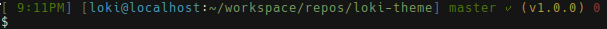

## Loki Theme ##

This theme is designed to make keeping track of git project versions / progress easy. It displays a collection of the usual theme information in addition to git tag info. When you're in a directory with git info, the theme will display the currently checked out branch, an X or ✓ indicating whether you've got uncommitted local changes, the latest tag, and the number of commits beyond that tag your local repo is.

### Install ###

I've provided an install script `install.sh` for convenience, which copies all files in this repo matching `*.zsh*` to `$HOME/.oh-my-zsh/custom`, the default oh-my-zsh location.
If your oh-my-zsh is installed elsewhere, just put the contents of this repo into your oh-my-zsh custom folder.

There are three theme files in the themes/ directory:
+ loki.zsh-theme  (for 256 color terminals)
+ loki8.zsh-theme (for 8 color terminals)
+ loki-old.zsh-theme (the old v1.0.0 theme which had color issues)

If you decide to use loki-old, you may need to change the colors of your terminal around to make it more palatable because my home setup (for which this was created) has some odd color settings. You can find my color settings for urxvt and xterm in <a href="https://github.com/subtlepseudonym/dotfiles/tree/master/Xresources/.Xresources.d">dotfiles</a>, which may help.

Enjoy
